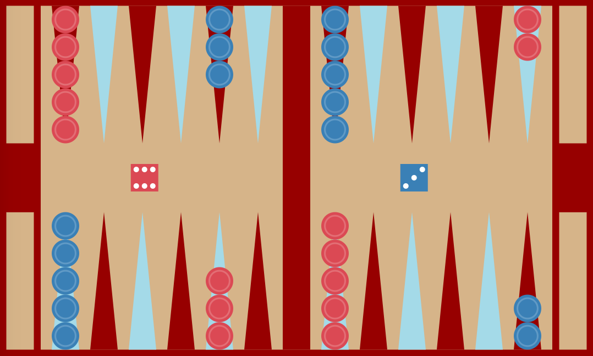
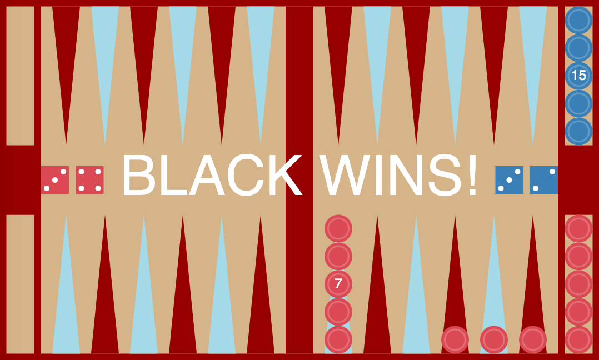
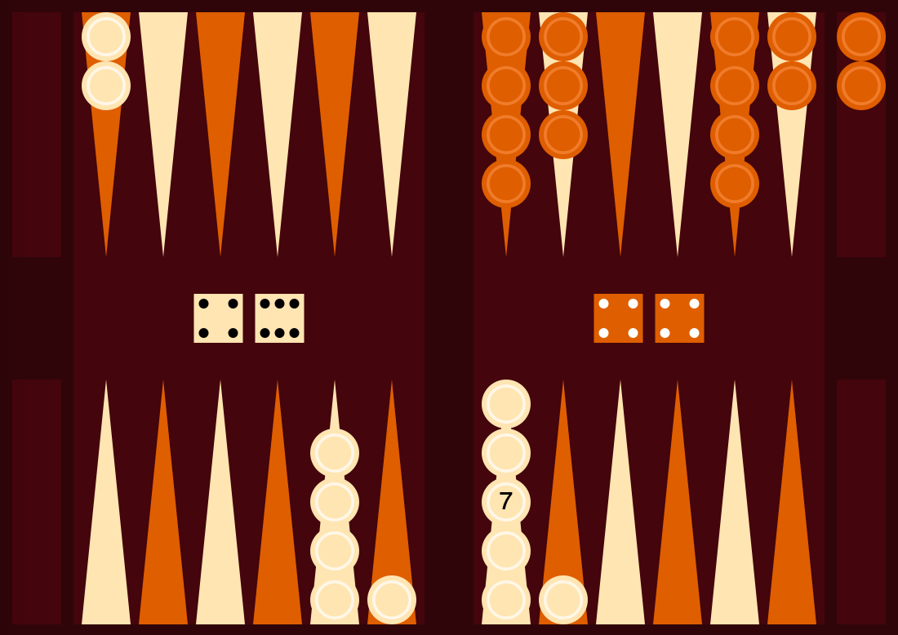

# Backgammon (CMSC 15100 Final Project)
Typed/Racket multiplayer backgammon program with support for undoing moves and storing/loading games through serialization—converts structured data into linear string representations and back. Makes ample use of recursion and linked lists. Developed in two styles, [**Original**](#Original) and [**Classic**](#Classic), as pictured below.

## Original
```
(run original)
```



## Classic
```
(run classic)
```


## How to Run
1. Clone this repo into your folder of choice.
    ```
    $ git clone https://github.com/jackandthebean/backgammon.git
    ```
2. In the `project3` folder, open the `project3-revised.rkt` file in the [DrRacket](https://download.racket-lang.org) programming environment and click **Run**.
3. In the _interactions window_ of the DrRacket IDE, make the function call `(run style)`, replacing "style" with your preferred style (`original` or `classic`).
4. Once a game is begun, it can be stored by striking the `s` key.
5. A previously stored game may be loaded by striking the `l` key. You will need to select the stored-game file for loading. The `project3` folder includes a sample `saved-game` file that can be loaded.
6. Moves within a game may be undone by striking the `u` key.
7. Have fun!
