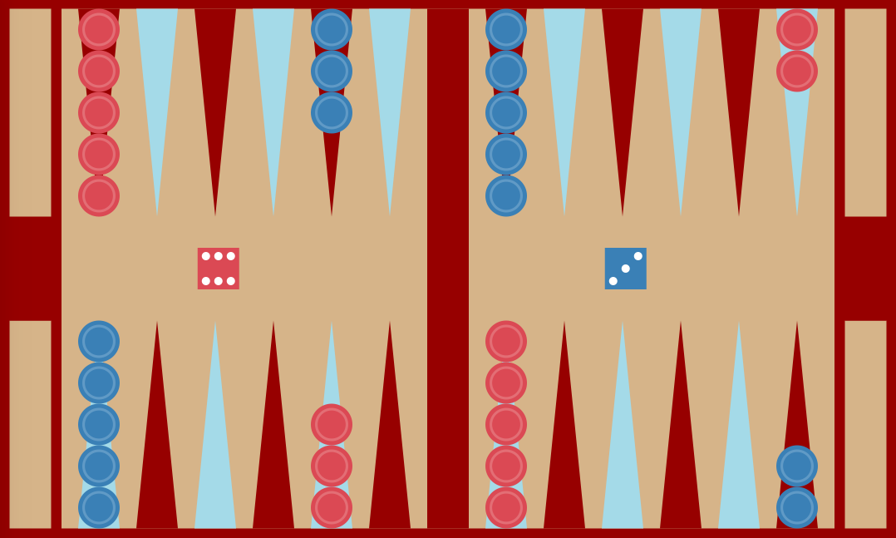
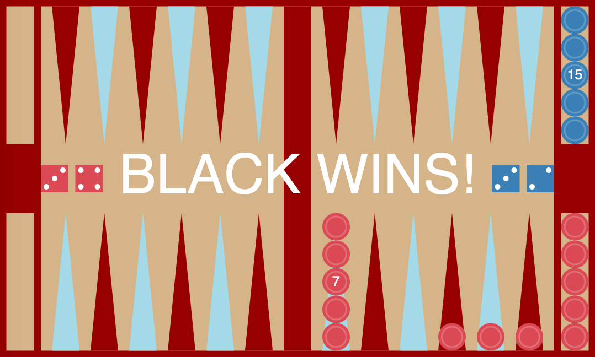

# Backgammon (CMSC 15100 Final Project)
Typed/Racket backgammon program with support for undoing moves and storing/loading games through serialization (converts structured data into a linear string representation and back). Makes ample use of recursion and linked lists, as well as structs. Developed in two styles: "original" and "classic" (as pictured below).

## Original

## Classic

